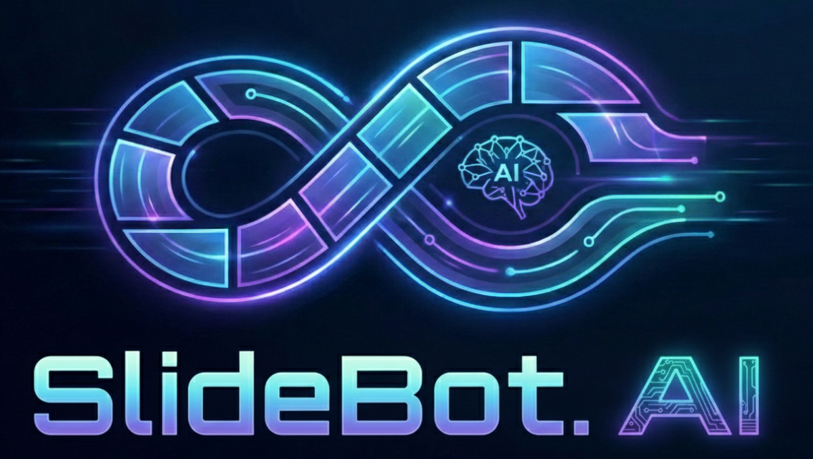
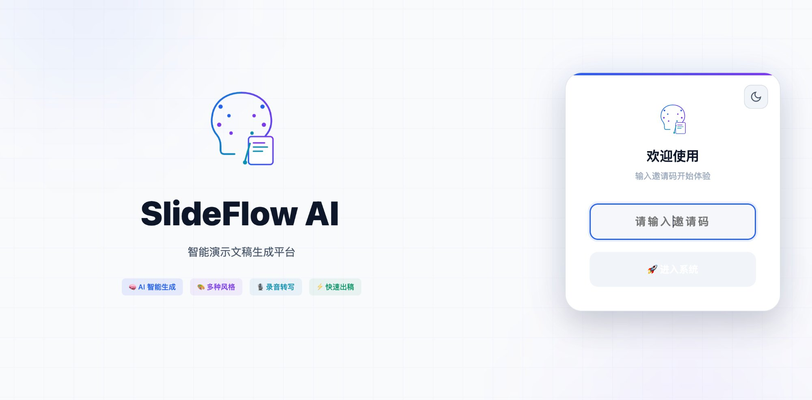
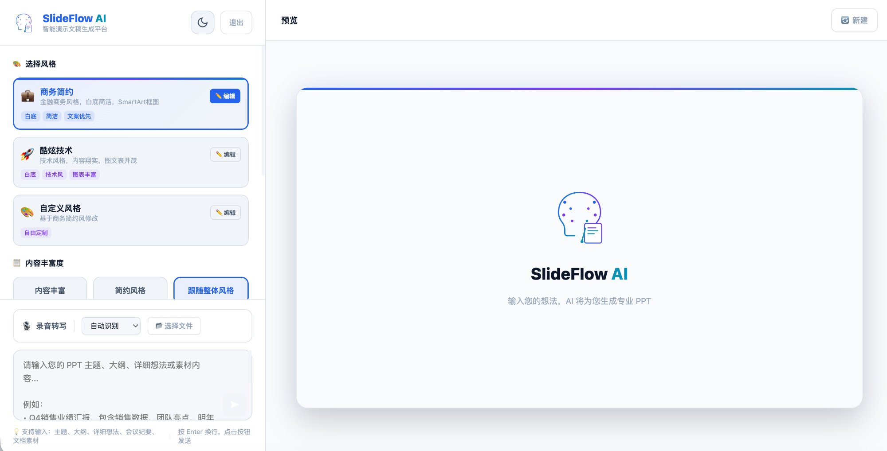
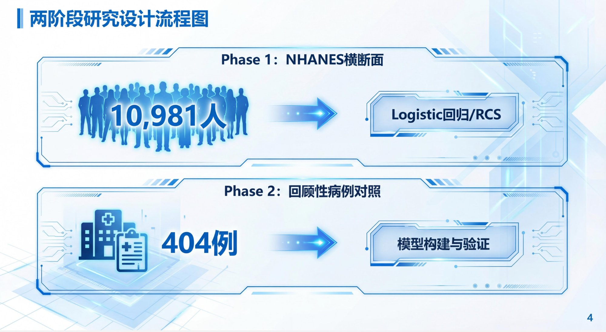
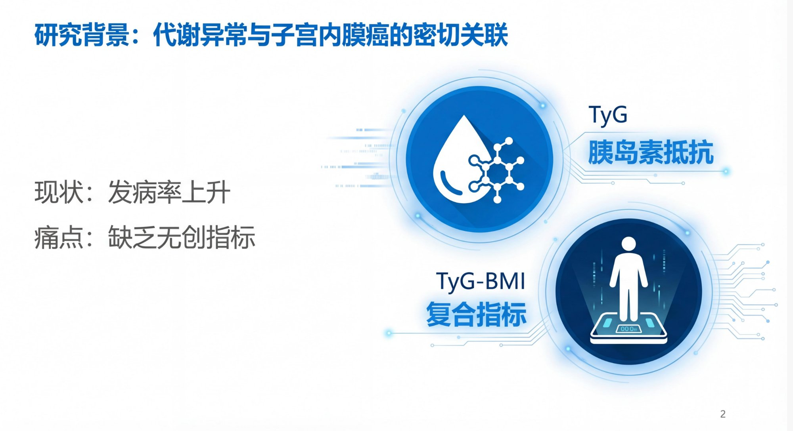
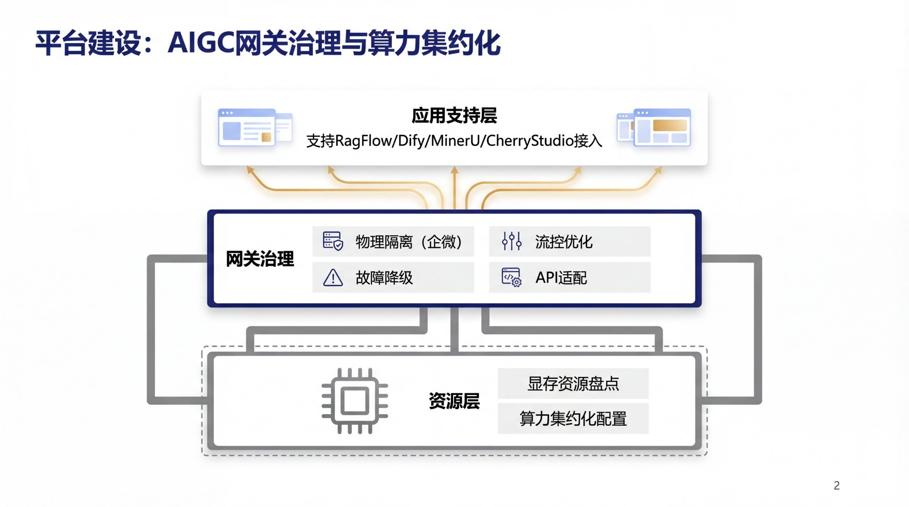
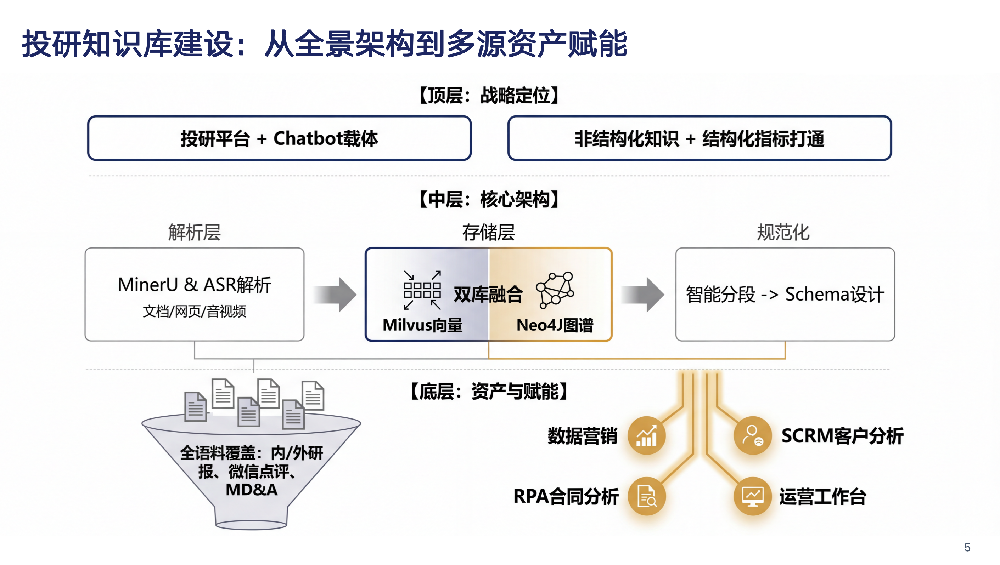
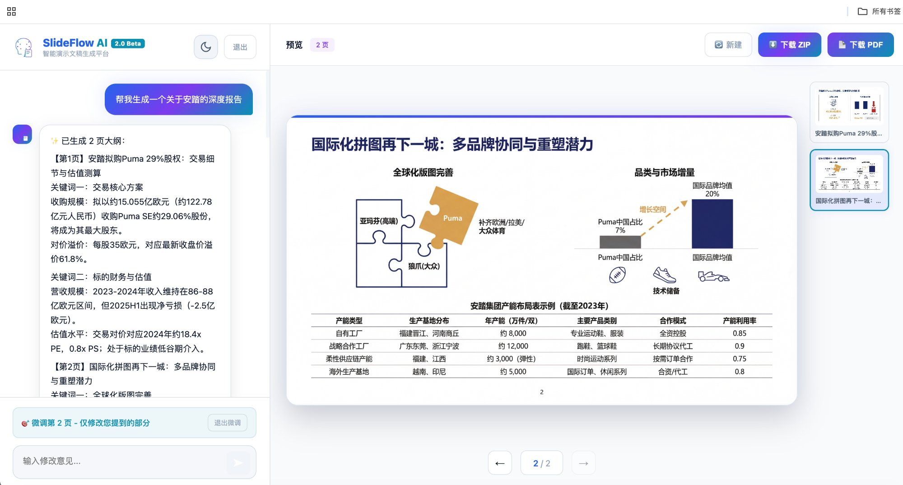

<div align="center">



# SlideFlow AI 2.0

### 智能演示文稿生成平台

**输入主题、大纲或素材，AI 帮你生成专业演示文稿**

[](https://opensource.org/licenses/MIT)
[](https://python.org)
[](https://reactjs.org)
[](https://fastapi.tiangolo.com)

[English](./README_EN.md) | [繁體中文](./README_TW.md) | **简体中文**

---

### 🚀 在线体验

我们已部署线上体验版本，欢迎试用！

🔗 **体验地址：[http://223.6.255.214/](http://223.6.255.214/) 【中国大陆】**
🔗 **体验地址：[http://47.77.231.44/](http://47.77.231.44/) 【海外】**

📮 需要内测邀请码？请联系作者获取！

</div>

---

## ✨ 2.0 新增功能

🆕 **📄 支持上传参考文档** - 项目报告、数据分析、会议纪要等，AI会自动提取要点辅助生成

🆕 **📊 支持插入图表素材** - 上传Excel表格或截图，AI直接嵌入对应页面

🆕 **💬 素材描述功能** - 为每个素材添加说明，AI理解更精准

---

## 🔄 2025年1月30日更新

🗜️ **图片压缩优化** - 生成的PPT图片自动压缩为JPEG格式（质量85%），文件体积减少60%以上，前端加载更快

---

## 🔄 2025年1月29日更新

🎉 **生成完成提示** - PPT生成完成后弹出提示窗口，快速下载ZIP/PDF或进入微调模式

⏳ **上传加载优化** - 素材上传过程中显示加载动画，上传完成前禁止关闭弹窗，避免误操作

🔄 **重新生成动画** - 单页重新生成时显示遮罩动画，清晰展示当前状态

📁 **文件格式验证** - 母版和Logo上传增加格式校验，仅支持PNG/JPG/WebP/GIF，不支持EMF/SVG等矢量格式

💡 **格式提示优化** - 上传区域显示明确的格式说明，避免用户上传不支持的文件类型

---

## 🔄 2025年1月28日更新

📝 **每页主旨设置** - 选择具体页数后，可为每一页单独设置主旨/主题，AI生成更精准的大纲

✏️ **大纲预览编辑** - 大纲生成后右侧预览区可直接编辑标题和内容，点击「应用编辑」同步到大纲

🎯 **图片微调模式** - 图片生成后点击页面进入微调模式，仅修改指定部分，其他元素保持不变

🔢 **页码显示控制** - 高级设置→布局设置中可选择隐藏页码

---

## ✨ 项目亮点

🚀 **一键生成** - 输入主题或想法，AI 自动生成完整 PPT，从大纲到设计一气呵成

🎙️ **语音转写** - 支持上传会议录音，AI 自动转写并整理成结构化演示文稿

📄 **文档理解** - 上传PDF/Word/PPT/Excel文档，AI自动提取关键信息

📊 **素材嵌入** - 为指定页面上传图表、截图、数据表格，AI直接嵌入PPT

🎨 **多种风格** - 内置商务简约、酷炫技术等预设风格，支持完全自定义

🖼️ **AI 绘图** - 基于 Google Gemini 图像生成模型，为每页生成专业级配图

📝 **实时协作** - 交互式修改大纲和设计，AI 理解你的反馈并即时调整

🎯 **精准控制** - 自定义配色、字体、页数、Logo，满足企业 VI 需求

---

## 📸 效果展示 

### 功能介绍动画

<div align="center">
<video src="https://github.com/user-attachments/assets/30d55221-8774-4ba9-9e70-0516a729d158" controls width="100%"></video>
</div>

### 登录界面

<div align="center">


*简洁优雅的登录界面，支持邀请码验证*
</div>

### 工作台

<div align="center">


*功能丰富的工作台：选择风格、调整内容丰富度、上传录音转写*
</div>

### 生成过程

<div align="center">


*实时显示生成进度，支持逐页预览和修改*
</div>

### 设计成果展示

<div align="center">

| 研究流程图 | 背景分析 |
|:---:|:---:|
|  |  |

| 架构图 | 业务分析 |
|:---:|:---:|
|  |  |

*AI 生成的专业级 PPT 页面，支持多种风格和布局*
</div>

### 📊 表格数据嵌入效果

<div align="center">


*支持上传Excel表格数据，AI自动理解并嵌入PPT页面，生成专业的数据展示*
</div>

---

## 🎬 完整工作流程

<div align="center">

### 从想法到 PPT 的完整旅程

</div>

```
┌─────────────────────────────────────────────────────────────────┐
│  Step 1: 📝 输入你的想法                                        │
│  ─────────────────────────────────────────────────────────────  │
│  "帮我做一个关于2026年AI发展趋势的PPT，                          │
│   面向投资人，需要数据支撑，10页左右"                            │
│                                                                  │
│  💡 可上传会议录音，AI 自动转写整理                              │
│  📄 可上传参考文档（PDF/Word/PPT/Excel），AI 自动提取要点        │
└─────────────────────────────────────────────────────────────────┘
                                 ↓
┌─────────────────────────────────────────────────────────────────┐
│  Step 2: 🎨 选择风格 & 配置参数                                  │
│  ─────────────────────────────────────────────────────────────  │
│  • 风格预设：商务简约 / 酷炫技术 / 自定义                        │
│  • 内容丰富度：内容丰富 / 简约风格 / 跟随整体                    │
│  • 页数控制：自动判断 或 指定 1-20 页                            │
│  • 高级设置：配色方案 / 字体 / Logo / 母版                       │
└─────────────────────────────────────────────────────────────────┘
                                 ↓
┌─────────────────────────────────────────────────────────────────┐
│  Step 3: 📋 AI 生成大纲（可修改）                                │
│  ─────────────────────────────────────────────────────────────  │
│  第1页：封面 - 2026 AI趋势展望                                   │
│  第2页：市场规模 - 万亿级赛道                                    │
│  第3页：技术突破 - 多模态与Agent                                 │
│  ...                                                             │
│                                                                  │
│  ✏️ 不满意？告诉 AI 你的修改意见，实时调整                       │
│  📊 可为指定页面上传图表素材（图片/Excel/粘贴的表格片段），生成时自动嵌入       │
└─────────────────────────────────────────────────────────────────┘
                                 ↓
┌─────────────────────────────────────────────────────────────────┐
│  Step 4: 🎯 AI 生成设计方案（可修改）                            │
│  ─────────────────────────────────────────────────────────────  │
│  为每一页生成详细的设计理念和视觉方案：                          │
│  • 页面布局结构                                                  │
│  • 配色运用说明                                                  │
│  • 图表/图形建议                                                 │
│                                                                  │
│  ✏️ 不满意？继续对话调整，直到满意为止                           │
└─────────────────────────────────────────────────────────────────┘
                                 ↓
┌─────────────────────────────────────────────────────────────────┐
│  Step 5: 🖼️ AI 逐页生成 PPT 图片                                │
│  ─────────────────────────────────────────────────────────────  │
│  🎨 正在生成第 3/10 页...                                        │
│  ████████████████░░░░░░░░░░░░ 50%                               │
│                                                                  │
│  📊 上传的素材会自动嵌入对应页面                                 │
│  ✏️ 单页不满意？点击缩略图，输入修改意见重新生成                 │
└─────────────────────────────────────────────────────────────────┘
                                 ↓
┌─────────────────────────────────────────────────────────────────┐
│  Step 6: 📥 下载成品                                             │
│  ─────────────────────────────────────────────────────────────  │
│  • ZIP 打包下载（所有图片）                                      │
│  • PDF 一键导出                                                  │
│  • 使用 WPS【PDF转PPT】工具进一步编辑                            │
└─────────────────────────────────────────────────────────────────┘
```

---

## 🛠️ 技术架构

```
┌─────────────────────────────────────────────────────────────────┐
│                        Frontend                              │
│  React 18 + 响应式设计 + 深色/浅色主题                       │
└─────────────────────────────────────────────────────────────────┘
                              │
                              ▼
┌─────────────────────────────────────────────────────────────────┐
│                        Backend                               │
│  FastAPI + Python 3.10+ + 异步架构                           │
└─────────────────────────────────────────────────────────────────┘
                              │
                              ▼
┌─────────────────────────────────────────────────────────────────┐
│                      AI Services                             │
│  Google Gemini (文本生成 + 图片生成)                         │
│  科大讯飞 iFlytek (语音转写)                                 │
└─────────────────────────────────────────────────────────────────┘
```

---

## 🚀 快速开始

### 环境要求

- Python 3.10+
- Node.js 18+
- Google Gemini API Key

### 安装步骤

```bash
# 1. 克隆项目
git clone https://github.com/tonyqinatcmu/SlideFlow.AI.git
cd SlideFlow.AI

# 2. 安装后端依赖
pip install -r requirements.txt

# 3. 配置环境变量
cp .env.example .env
# 编辑 .env 文件，填入你的 API Key

# 4. 安装前端依赖并构建
cd frontend
npm install
npm run build
cd ..

# 5. 启动服务
python server.py
```

访问 `http://localhost:8001` 开始使用！ 默认邀请码为"VISITOR", 可以修改invite_codes.json文件。  

---

## ⚙️ 配置说明

在 `.env` 文件中配置以下参数：

```env
# Google Gemini API (必需)
GEMINI_API_KEY=your_gemini_api_key

# 科大讯飞语音转写 (可选，用于录音转写功能)
IFLYTEK_APP_ID=your_iflytek_app_id
IFLYTEK_API_SECRET=your_iflytek_api_secret

# 服务配置
PORT=8001
HOST=0.0.0.0
```

### API 密钥获取

| 服务 | 用途 | 获取地址 |
|------|------|----------|
| Google Gemini | 文本/图像生成 | [Google AI Studio](https://makersuite.google.com/app/apikey) |
| 科大讯飞 | 语音转写（可选） | [讯飞开放平台](https://www.xfyun.cn/) |

---

## 📁 项目结构

```
slideflow/
├── server.py              # 后端主程序（FastAPI路由）
├── requirements.txt       # Python 依赖
├── .env.example           # 环境变量示例
├── .gitignore             # Git 忽略配置
├── LICENSE                # MIT 开源协议
├── invite_codes.json      # 邀请码配置
│
├── modules/               # 后端模块（模块化架构）
│   ├── __init__.py       # 模块导出
│   ├── config.py         # 配置常量（API密钥、路径等）
│   ├── prompts.py        # AI提示词模板
│   ├── models.py         # Pydantic数据模型
│   ├── asr.py            # 科大讯飞语音转写
│   ├── invite_codes.py   # 邀请码管理
│   ├── session.py        # 会话状态管理
│   ├── gemini_api.py     # Gemini API调用封装
│   └── visit_counter.py  # 访问计数器
│
├── frontend/              # React 前端
│   ├── src/
│   │   ├── App.js        # 主组件（包含所有UI逻辑）
│   │   └── index.js      # 入口文件
│   ├── public/
│   │   ├── index.html
│   │   └── wps-tip.png   # WPS 提示图
│   └── package.json
│
├── docs/                  # 文档资源
│   └── images/           # README 截图
│
├── outputs/               # 生成的图片输出（自动创建）
├── references/            # 上传的参考文件（自动创建）
├── audio/                 # 录音文件（自动创建）
└── records/               # 使用记录（自动创建）
```

---

## 🎨 功能特性

### 核心功能

| 功能 | 描述 |
|------|------|
| 🤖 智能大纲 | 根据输入自动生成结构化PPT大纲，支持实时修改 |
| 🎨 风格设计 | AI为每页生成详细的设计方案和视觉理念 |
| 🖼️ 图片生成 | 使用Gemini生成专业级配图，支持2K/4K分辨率 |
| 📝 实时迭代 | 对话式交互，随时调整内容和设计 |
| 📥 多格式导出 | 支持ZIP打包和PDF一键导出 |

### 高级功能

| 功能 | 描述 |
|------|------|
| 🎙️ 录音转写 | 上传会议录音，AI自动转写并整理成PPT |
| 🏢 母版支持 | 上传企业母版图片，保持VI一致性 |
| 🎯 自定义配色 | 灵活配置主色、辅助色、强调色 |
| 📝 自定义字体 | 中英文字体分别设置 |
| 📊 内容丰富度 | 数据丰富/简约风格自由切换 |
| 🌙 深色模式 | 支持深色/浅色主题切换 |

### 🚧 开发计划 (TODO)

- [x] 智能大纲生成与迭代修改
- [x] AI 设计风格生成
- [x] Gemini 图片逐页生成
- [x] 录音转写整理成 PPT
- [x] 自定义配色、字体、Logo
- [x] ZIP / PDF 多格式导出
- [x] 素材上传 - 支持用户上传 PDF、Word、PPT、Excel、图片等素材，AI 自动提取整理
- [ ] **演讲稿生成** - 除 PPT 外，为用户生成配套的演讲稿 / 讲稿
- [ ] **风格持久化** - 保存用户的个性化风格偏好，下次使用自动加载

---

## 🔧 开发指南

### 本地开发

```bash
# 后端开发（热重载）
uvicorn server:app --reload --port 8001

# 前端开发
cd frontend
npm start
```

### 生产部署

推荐使用以下方式部署：

```bash
# 生产环境部署
uvicorn server:app --host 0.0.0.0 --port 8001

# 或使用 Docker（可自行编写 Dockerfile）
```

配合 Nginx 反向代理和 Systemd 服务管理可实现更稳定的生产环境部署。

---

## 🤝 贡献指南

我们欢迎所有形式的贡献！

1. Fork 本项目
2. 创建你的特性分支 (`git checkout -b feature/AmazingFeature`)
3. 提交你的更改 (`git commit -m 'Add some AmazingFeature'`)
4. 推送到分支 (`git push origin feature/AmazingFeature`)
5. 开启一个 Pull Request

---

## 📄 开源协议

本项目采用 [MIT License](LICENSE) 开源协议。

---

### 开源项目

- [Google Gemini](https://deepmind.google/technologies/gemini/) - 多模态AI模型
- [科大讯飞](https://www.xfyun.cn/) - 语音转写服务
- [FastAPI](https://fastapi.tiangolo.com/) - 现代高性能Python Web框架
- [React](https://reactjs.org/) - 用户界面构建库

---

## ⭐ Star History

如果这个项目对你有帮助，请给我们一个 Star ⭐

[](https://star-history.com/#tonyqinatcmu/SlideFlow.AI&Date)

---

## 👨‍💻 联系作者

<div align="center">

### Shenlin (Tony) Qin

| 📧 邮箱 | 💬 微信 | 🔗 LinkedIn |
|:---:|:---:|:---:|
| [tonyqinatcmu@gmail.com](mailto:tonyqinatcmu@gmail.com) |  | [](https://hk.linkedin.com/in/shenlinqin) |

---

### Jie Tang

| 📧 邮箱 | 💬 微信 | 🔗 LinkedIn |
|:---:|:---:|:---:|
| [jobtj@sina.com](mailto:jobtj@sina.com) |  | [](https://www.linkedin.com/in/jay-tang-a0773352) |

---

欢迎交流探讨 AI、产品设计、创业等话题！

</div>

---

<div align="center">

**用 ❤️ 打造 | Made with ❤️**

[报告Bug](https://github.com/tonyqinatcmu/SlideFlow.AI/issues) · [功能建议](https://github.com/tonyqinatcmu/SlideFlow.AI/issues) · [讨论区](https://github.com/tonyqinatcmu/SlideFlow.AI/discussions)

</div>
